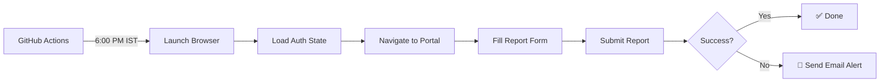

# 🤖 Kalvium Daily Report Automation

> Automated daily report submission for Kalvium internship portal using Playwright and GitHub Actions

[](https://github.com/features/actions)
[](https://nodejs.org/)
[](https://playwright.dev/)

---

## 📋 Overview

This tool automates the daily report submission process for Kalvium internships. It runs automatically every weekday at **6:00 PM IST** via GitHub Actions, filling out and submitting your daily tasks, challenges, and blockers.

### ✨ Features

- 🕐 **Automated scheduling** - Runs Monday to Friday at 6:00 PM IST
- 🔐 **Secure authentication** - Uses saved Google OAuth session
- 📧 **Email notifications** - Get notified if automation fails
- 🎯 **Zero maintenance** - Set it up once, runs forever
- 🚀 **Manual trigger** - Run on-demand via GitHub Actions UI

---

## 🛠️ How It Works



1. **Authentication**: Uses Playwright to save your Google login session
2. **Automation**: Navigates to Kalvium portal and fills the daily report
3. **Scheduling**: GitHub Actions triggers the script every weekday
4. **Monitoring**: Sends email alerts on failure

---

## 🚀 Setup Guide

### Prerequisites

- Node.js 18 or higher
- GitHub account
- Gmail account (for failure notifications)
- Kalvium internship portal access

### Step 1: Clone & Install

```bash
git clone <your-repo-url>
cd kalvium-daily-automation
npm install
npx playwright install chromium
```

### Step 2: Generate Authentication

Run the login script to save your Google session:

```bash
node login.js
```

**Follow the prompts:**
1. Browser window will open
2. Click "Continue with Google"
3. Select your Kalvium email (`@kalvium.community`)
4. Wait for the page to fully load
5. Press ENTER in the terminal

This creates `auth.json` with your session data.

### Step 3: Configure GitHub Secrets

Go to your repository → **Settings** → **Secrets and variables** → **Actions**

Add these secrets:

| Secret Name | Description | Example |
|------------|-------------|---------|
| `AUTH_STATE` | Content of `auth.json` file | `{"cookies": [...]}` |
| `EMAIL_USERNAME` | Your Gmail address | `your-email@gmail.com` |
| `EMAIL_PASSWORD` | Gmail App Password* | `abcd efgh ijkl mnop` |
| `EMAIL_TO` | Email to receive alerts | `your-email@gmail.com` |

> **\*Gmail App Password**: Go to [Google Account Security](https://myaccount.google.com/security) → 2-Step Verification → App passwords → Generate

### Step 4: Customize Report Content

Edit `index.js` and update the `BACKUP_TASK` variable with your daily report template:

```javascript
const BACKUP_TASK = `
📋 Tasks completed today
Your tasks here...

⚡ Challenges encountered and how you overcame them
Your challenges here...

🚧 Blockers faced
Your blockers here...
`.trim();
```

### Step 5: Enable GitHub Actions

1. Go to **Actions** tab in your repository
2. Enable workflows if prompted
3. The automation will run automatically at 6:00 PM IST (Mon-Fri)

---

## 📅 Schedule Configuration

The workflow runs on this schedule:

```yaml
schedule:
  - cron: '30 12 * * 1-5'  # 6:00 PM IST (12:30 PM UTC)
```

**To change the time:**
- Edit `.github/workflows/run.yml`
- Modify the cron expression
- Remember: GitHub Actions uses UTC time (IST = UTC + 5:30)

---

## 🎮 Manual Execution

Run the automation manually:

### Locally
```bash
npm start
```

### Via GitHub Actions
1. Go to **Actions** tab
2. Select "Kalvium Daily Report" workflow
3. Click **Run workflow** → **Run workflow**

---

## 📂 Project Structure

```
kalvium-daily-automation/
├── .github/
│   └── workflows/
│       └── run.yml          # GitHub Actions workflow
├── index.js                 # Main automation script
├── login.js                 # Authentication helper
├── auth.json               # Saved session (gitignored)
├── package.json            # Dependencies
└── README.md              # This file
```

---

## 🔧 Troubleshooting

### Authentication Issues

**Problem**: "Not logged in" or session expired

**Solution**:
```bash
# Re-run login script
node login.js

# Update AUTH_STATE secret with new auth.json content
cat auth.json  # Copy this to GitHub secret
```

### Email Notifications Not Working

**Problem**: Not receiving failure emails

**Solution**:
- Verify Gmail App Password is correct
- Check if 2-Step Verification is enabled
- Ensure `EMAIL_TO` secret is set correctly

### Workflow Not Running

**Problem**: Automation doesn't trigger at scheduled time

**Solution**:
- Check if Actions are enabled in repository settings
- Verify the workflow file is in `.github/workflows/`
- GitHub Actions may have 3-10 minute delays

### Form Submission Fails

**Problem**: Script runs but report not submitted

**Solution**:
- Kalvium portal UI may have changed
- Check GitHub Actions logs for errors
- Update selectors in `index.js` if needed

---

## 🔒 Security Notes

- ✅ `auth.json` is gitignored - never commit it
- ✅ All credentials stored as GitHub Secrets
- ✅ Secrets are encrypted and not visible in logs
- ✅ Use Gmail App Passwords, not your actual password

---

## 📝 Customization

### Change Report Content Dynamically

You can modify the script to fetch content from:
- Google Sheets API
- Notion API
- Local markdown files
- Environment variables

Example with environment variable:

```javascript
const finalText = process.env.DAILY_REPORT || BACKUP_TASK;
```

Then add `DAILY_REPORT` to GitHub Secrets.

---

## 🤝 Contributing

Feel free to fork and customize for your needs. If you find bugs or have improvements, PRs are welcome!

---

## 📄 License

MIT License - feel free to use and modify as needed.

---

## 💡 Tips

- Test locally with `npm start` before relying on automation
- Keep `auth.json` updated (re-run `login.js` monthly)
- Monitor your email for failure notifications
- Check GitHub Actions logs if something seems off

---

